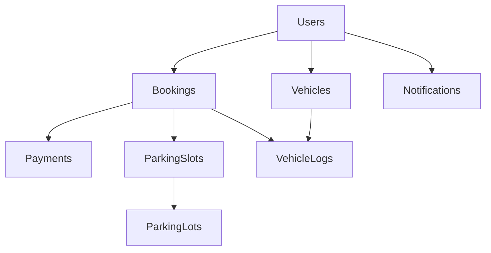

# 🚗 ParQHub - Smart Parking Management System

[](https://www.oracle.com/java/)
[](https://spring.io/projects/spring-boot)
[](https://www.mysql.com/)
[](LICENSE)

> An intelligent, automated vehicle parking reservation and management platform designed to streamline urban parking solutions.

## 🌟 Overview

ParQHub is a comprehensive parking management system that revolutionizes how users find, book, and manage parking spaces. Built with modern web technologies, it offers seamless integration between users, parking facilities, and administrative management.

### 🎯 Key Features

#### 👥 **User Features**
- **Smart Parking Discovery**: Real-time search and filtering of available parking spots
- **Instant Reservations**: Book parking spaces with just a few clicks
- **Multi-Vehicle Management**: Register and manage multiple vehicles per account
- **Payment Integration**: Secure payment processing with receipt generation
- **Booking History**: Complete transaction and booking history tracking
- **Real-time Notifications**: Get updates on booking status, payments, and system alerts
- **Profile Management**: Comprehensive user settings and profile customization

#### 🔧 **Admin Features**
- **Comprehensive Dashboard**: Real-time analytics and system monitoring
- **Parking Lot Management**: Add, edit, and monitor parking facilities
- **User Management**: Complete user account and vehicle registration oversight
- **Financial Reporting**: Detailed revenue analytics with export capabilities
- **Occupancy Analytics**: Track parking utilization and performance metrics
- **System Monitoring**: Monitor system health and user activities

#### 🏢 **System Features**
- **Real-time Availability**: Live parking space status updates
- **Dynamic Pricing**: Flexible pricing models based on location and demand
- **Automated Notifications**: Email-based communication system
- **Responsive Design**: Optimized for desktop, tablet, and mobile devices
- **Security**: Role-based access control and secure authentication

## 🏗️ System Architecture

### Technology Stack

#### Backend
- **Framework**: Spring Boot 3.3.4
- **Language**: Java 21
- **Database**: MySQL 8.0
- **ORM**: Spring Data JPA with Hibernate
- **Security**: Spring Security (role-based authentication)
- **Email**: Spring Mail with SMTP integration

#### Frontend
- **Template Engine**: Thymeleaf
- **Styling**: Tailwind CSS 3.x
- **Icons**: Font Awesome 6.4.0
- **Typography**: Inter Font Family
- **UI Components**: Custom glass morphism and gradient designs

#### Database Design
```sql
-- Core entities
├── users (user management)
├── vehicles (vehicle registration)
├── parking_lots (facility management)
├── parking_slots (space inventory)
├── bookings (reservation management)
├── payments (transaction processing)
├── notifications (communication system)
├── vehicle_logs (entry/exit tracking)
└── admins (administrative access)
```

## 🚀 Quick Start

### Prerequisites

Before running ParQHub, ensure you have the following installed:

- **Java Development Kit (JDK) 21** or higher
- **MySQL Server 8.0** or higher
- **Maven 3.6** or higher
- **Git** for version control

### Installation

1. **Clone the Repository**
   ```bash
   git clone https://github.com/your-username/parqhub.git
   cd parqhub
   ```

2. **Database Setup**
   ```sql
   -- Create database
   CREATE DATABASE parqhub_db;
   
   -- Create user (optional)
   CREATE USER 'parqhub_user'@'localhost' IDENTIFIED BY 'your_password';
   GRANT ALL PRIVILEGES ON parqhub_db.* TO 'parqhub_user'@'localhost';
   FLUSH PRIVILEGES;
   ```

3. **Configure Application**
   
   Update `src/main/resources/application.properties`:
   ```properties
   # Database Configuration
   spring.datasource.url=jdbc:mysql://localhost:3306/parqhub_db?useSSL=false&serverTimezone=UTC
   spring.datasource.username=root
   spring.datasource.password=your_password
   
   # Email Configuration (Gmail SMTP)
   spring.mail.username=your-email@gmail.com
   spring.mail.password=your-app-password
   ```

4. **Build and Run**
   ```bash
   # Install dependencies
   mvn clean install
   
   # Run the application
   mvn spring-boot:run
   ```

5. **Access the Application**
   - **Main Application**: http://localhost:8080
   - **User Login**: http://localhost:8080/login
   - **Admin Portal**: http://localhost:8080/admin/login
   - **Registration**: http://localhost:8080/register

## 📱 User Interface

### Design Philosophy

ParQHub features a modern, dark-themed interface with distinct color schemes for different user roles:

#### 🌙 **User Interface** (Blue Theme)
- **Primary Colors**: Blue gradients (#3b82f6 to #1d4ed8)
- **Background**: Dark navy with floating blue orbs
- **Glass Morphism**: Translucent cards with backdrop blur
- **Interactive Elements**: Smooth hover animations and transitions

#### 🔴 **Admin Interface** (Red Theme)  
- **Primary Colors**: Red gradients (#dc2626 to #b91c1c)
- **Background**: Dark crimson with security-focused design
- **Access Control**: Warning badges and security notices
- **Professional Layout**: Clean, business-oriented interface

#### 🧡 **Registration Interface** (Orange Theme)
- **Primary Colors**: Orange gradients (#f97316 to #ea580c)
- **Background**: Warm dark tones with orange accents
- **Dynamic Forms**: Multi-step vehicle registration
- **User-Friendly**: Intuitive form design with clear validation

### Key UI Components

- **Floating Shapes**: Animated background elements for visual appeal
- **Glass Cards**: Translucent containers with backdrop blur effects
- **Gradient Buttons**: Modern button design with hover animations
- **Responsive Layout**: Mobile-first design approach
- **Loading States**: Smooth transition feedback for user actions

## 🔧 Development

### Project Structure

```
parqhub/
├── src/
│   ├── main/
│   │   ├── java/com/prmplatform/parqhub/
│   │   │   ├── controller/           # REST controllers
│   │   │   │   ├── admin/           # Admin-specific controllers
│   │   │   │   └── user/            # User-specific controllers
│   │   │   ├── model/               # JPA entities and DTOs
│   │   │   ├── repository/          # Data access layer
│   │   │   └── ParqHubApplication.java
│   │   └── resources/
│   │       ├── templates/           # Thymeleaf templates
│   │       │   ├── admin/          # Admin interface pages
│   │       │   └── user/           # User interface pages
│   │       ├── static/             # Static assets
│   │       └── application.properties
│   └── test/                       # Unit and integration tests
├── pom.xml                         # Maven dependencies
└── README.md
```

### Key Controllers

#### User Controllers
- **UserController**: Authentication, dashboard, profile management
- **BookingController**: Parking reservations and booking management
- **PaymentController**: Payment processing and receipt generation
- **VehicleLogController**: Entry/exit tracking

#### Admin Controllers
- **AdminController**: Admin authentication and dashboard
- **ManageTablesController**: CRUD operations for all entities
- **ReportController**: Analytics and reporting functionality

### Database Relationships



## 🛠️ API Endpoints

### User Endpoints
```http
GET    /user/dashboard          # User dashboard
POST   /user/login              # User authentication
GET    /user/findparking        # Search available parking
POST   /user/book               # Create booking
GET    /user/bookings           # View booking history
POST   /user/payment            # Process payment
GET    /user/vehicles           # Manage vehicles
GET    /user/notifications      # View notifications
```

### Admin Endpoints
```http
GET    /admin/dashboard         # Admin dashboard
POST   /admin/login             # Admin authentication
GET    /admin/tables            # Data management interface
GET    /admin/reports           # Analytics and reports
POST   /admin/manage            # CRUD operations
GET    /admin/parking-viewer    # Real-time parking monitor
```

## 📊 Features Breakdown

### 🎫 Booking System
- **Real-time Availability**: Live parking space status
- **Smart Scheduling**: Conflict-free reservation system
- **Flexible Duration**: Hourly, daily, or custom booking periods
- **Automatic Confirmation**: Instant booking confirmation emails

### 💳 Payment Processing
- **Secure Transactions**: Encrypted payment processing
- **Multiple Payment Methods**: Card, digital wallets support
- **Receipt Generation**: Automated receipt creation and email delivery
- **Transaction History**: Complete payment audit trail

### 📱 Notification System
- **Email Integration**: SMTP-based email notifications
- **Event-Driven**: Automated notifications for bookings, payments, reminders
- **Customizable**: User preference-based notification settings
- **Admin Alerts**: System monitoring and issue notifications

### 📈 Analytics & Reporting
- **Revenue Analytics**: Financial performance tracking
- **Occupancy Reports**: Parking utilization metrics
- **User Analytics**: User behavior and engagement insights
- **Export Capabilities**: CSV/PDF report generation

## 🔒 Security Features

### Authentication & Authorization
- **Role-Based Access**: Separate user and admin access levels
- **Session Management**: Secure session handling
- **Password Security**: Encrypted password storage
- **Access Control**: Protected endpoints and data isolation

### Data Protection
- **Input Validation**: Server-side validation for all inputs
- **SQL Injection Prevention**: Parameterized queries with JPA
- **XSS Protection**: Template-based rendering with Thymeleaf
- **CSRF Protection**: Cross-site request forgery prevention

## 🚀 Deployment

### Production Deployment

1. **Build Production JAR**
   ```bash
   mvn clean package -Dmaven.test.skip=true
   ```

2. **Environment Configuration**
   ```properties
   # Production database
   spring.datasource.url=jdbc:mysql://production-db:3306/parqhub_db
   spring.profiles.active=production
   
   # Security settings
   server.port=8080
   server.servlet.context-path=/parqhub
   ```

3. **Run Application**
   ```bash
   java -jar target/parqhub-0.0.1-SNAPSHOT.jar
   ```

### Docker Deployment

```
FROM openjdk:21-jdk-slim
COPY target/parqhub-0.0.1-SNAPSHOT.jar app.jar
EXPOSE 8080
ENTRYPOINT ["java","-jar","/app.jar"]
```

## 🧪 Testing

### Running Tests
```bash
# Run all tests
mvn test

# Run specific test class
mvn test -Dtest=UserControllerTest

# Run with coverage
mvn test jacoco:report
```

### Test Coverage
- **Unit Tests**: Controller and service layer testing
- **Integration Tests**: Database and API endpoint testing
- **UI Tests**: Frontend functionality validation

## 🤝 Contributing

### Development Workflow

1. **Fork the Repository**
2. **Create Feature Branch**
   ```bash
   git checkout -b feature/your-feature-name
   ```
3. **Make Changes**
4. **Write Tests**
5. **Submit Pull Request**

### Code Standards
- **Java**: Follow Oracle Java coding conventions
- **Spring Boot**: Adhere to Spring Boot best practices
- **Database**: Use proper naming conventions and indexing
- **Frontend**: Maintain consistent styling and responsive design

## 📋 Roadmap

### Upcoming Features
- [ ] **Mobile Application**: Native iOS and Android apps
- [ ] **QR Code Integration**: QR-based parking access
- [ ] **IoT Integration**: Smart parking sensors
- [ ] **Machine Learning**: Predictive parking analytics
- [ ] **Multi-language Support**: Internationalization
- [ ] **Advanced Security**: Two-factor authentication

### Version History
- **v1.0.0**: Core parking management system
- **v1.1.0**: Enhanced UI/UX with dark themes
- **v1.2.0**: Advanced reporting and analytics (planned)

## 🐛 Troubleshooting

### Common Issues

#### Database Connection
```bash
# Check MySQL service
systemctl status mysql

# Test connection
mysql -u root -p -h localhost parqhub_db
```

#### Email Configuration
```properties
# Gmail App Password required
spring.mail.password=your-16-digit-app-password
```

#### Port Conflicts
```properties
# Change default port
server.port=8081
```


### Community
- **GitHub Discussions**: Project discussions and Q&A
- **Stack Overflow**: Tag questions with `parqhub`

## 📄 License

This project is licensed under the MIT License - see the [LICENSE](LICENSE) file for details.

## 🙏 Acknowledgments

- **Spring Boot Team**: For the excellent framework
- **Tailwind CSS**: For the utility-first CSS framework  
- **Font Awesome**: For the comprehensive icon library
- **MySQL**: For reliable database management
- **Thymeleaf**: For powerful template processing

---


⭐ **Star this repository if you find it helpful!**

*Built with ❤️ for smarter urban mobility*